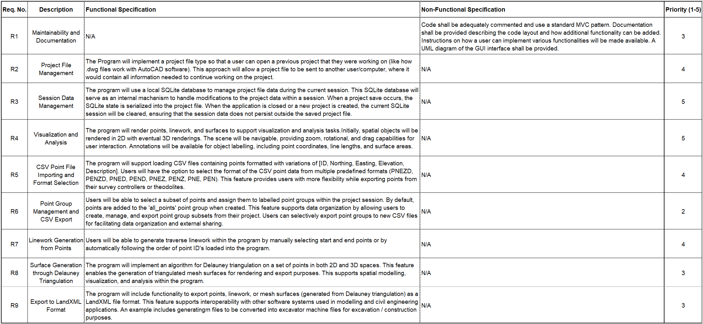

# Survey Visualizer

This is a prototype for a project that allows 2D and 3D cadastral survey data to be stored to a local database and visualized. It is implemented as a Windows application in C++ using the QT framework.

## Requirements Traceability Matrix (RTM):

The initial Requirements Traceability Matrix established for the Windows application is as follows:

## Initial 2D Point and Line Rendering Progress

The first implementation of the application loaded 3 hard coded points and lines, and rendered them in 2D in the display window:

## Initial Scene Navigation Progress

A video demonstrating the initial scene navigation capabilities, including zoom and drag functionalities, can be seen in the video below:

